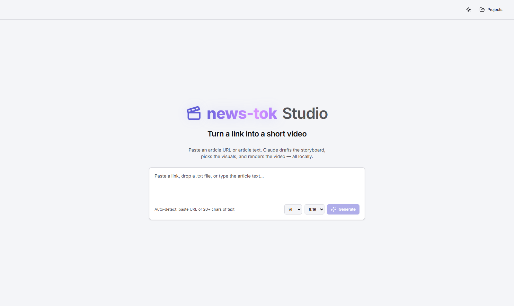
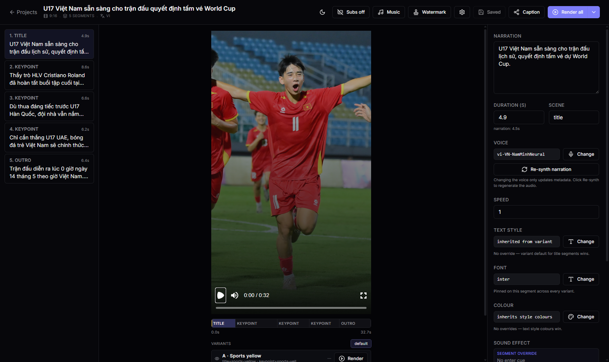
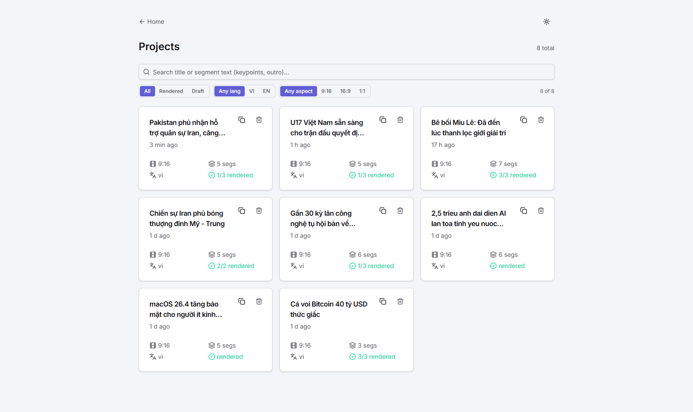

# news-tok

Turn **articles, plain text, or website links** into **short videos** (TikTok / Reels / Shorts) — runs 100% **locally**.

> **Two clearly separated halves:**
> - **Claude CLI in the terminal** — the AI orchestrator that drafts the project (extract, plan, fetch assets, render).
> - **Local Web Studio** — the editor surface that previews and fine-tunes the result after Claude is done.

The Node app has no embedded "AI orchestrator". The Claude Code CLI **is** the orchestrator, and the Web Studio is its companion editor.

---

## Features

- **Flexible input**: paste text, an article URL, or a file path — from either the terminal or the Studio home page.
- **Two entry points to the AI orchestrator**:
  - **Claude CLI in the terminal** — full power, asks follow-up questions, lets you fork scene TSX for custom effects.
  - **Web Studio home page** — paste a URL and click Generate; Studio spawns `claude -p` headless and surfaces each tool call as a step indicator until the mp4 lands.
- **Claude writes and edits scene TSX** when you ask for a custom effect (e.g. "give segment 2 a Cyberpunk glitch"). It forks a built-in scene into `data/projects/<id>/scenes/` and the dynamic scene resolver picks it up.
- **Free neural TTS** (VI + EN) via Microsoft Edge voices, with per-word timing for subtitles, karaoke, and per-word SFX cues.
- **AI-picked music and images** from Pexels, Unsplash, Openverse, and Internet Archive — all commercial-friendly licenses.
- **Formats**: 9:16 (TikTok), 16:9, 1:1 — with export presets for TikTok 60fps / YouTube Shorts / Reels.
- **Web Studio**: light / dark / system theme, segment timeline with click-to-seek, inline narration editor, image / music / voice / SFX / logo / text-style pickers, real-time `<Player>` preview, render-progress bar, captions on by default with word boundaries baked in.
- **Render variants**: pick 3 looks per project (e.g. Sports yellow / Bebas impact / TikTok caption) and render `output-A.mp4` / `output-B.mp4` / `output-C.mp4` in one pass.
- **Per-project custom assets**: upload your own SFX (≤ 500 KB, ≤ 5 s) and watermark (image or text), build your own text styles in-app — all scoped to one project so renders stay deterministic.
- **100% local**: assets are cached on disk; outbound traffic only reaches your chosen providers (Pexels, Unsplash, Pixabay, Internet Archive, Openverse, Microsoft Edge TTS) and Claude.
- **Subscription-based** — no Anthropic API key. Auth via `claude login` with a Pro/Max subscription.
- **Unified iconography**: a single icon set — **Lucide React** — is shared by Studio and Remotion compositions. **No emoji anywhere** (Studio UI, scene TSX, CLAUDE.md, docs, commit messages).

---

## Screenshots

Studio home — paste a URL or article text and Claude does the rest, locally:



Project editor — pick variants, swap assets, fine-tune narration, toggle the watermark, all with a live `<Player>` preview:



Project list — every project Claude has created, with thumbnails, language / aspect filters, and search:



Light theme is supported on every page; the toggle in the header cycles System → Light → Dark.

---

## Two surfaces

### 1) Claude CLI (terminal) — the AI side

```bash
cd D:/Github/news-tok
claude
> Create a 30s video from https://vnexpress.net/... — Vietnamese, 9:16
```

Claude will:

1. Call the MCP tool `extractArticle` to read the article.
2. **Confirm the story structure** with you (intro → body → outro). The default and recommended option is the full three-part structure.
3. Draft a storyboard and write it to `data/projects/<id>/storyboard.json`.
4. Call `searchImage`, `searchMusic`, `synthesizeVoice` in parallel.
5. Call `renderProject` → `output.mp4`.
6. Report the file path so you can open it in Studio or any media player.

Later, if you say "give segment 2 a glitch effect like Cyberpunk", Claude will `Read` the storyboard, fork a scene into `data/projects/<id>/scenes/CyberpunkGlitch.tsx`, point that segment at the new scene, and call `renderSegment` to re-render just that piece.

### 2) Web Studio (`pnpm studio`) — the editor side

```bash
pnpm studio   # opens http://localhost:3000
```

- **Project list** — every project Claude has created under `data/projects/`.
- **Segment timeline** — click-to-seek, playhead synced to the Remotion `<Player>`.
- **Inline inspector** — edit narration text, duration, scene, voice, speed, and background image.
- **Asset pickers** — search Pexels / Unsplash / Internet Archive / Pixabay through dialogs.
- **Real-time preview** — Remotion `<Player>` driven by `storyboard.json`.
- **Dirty-save indicator** — an amber dot on the Save button when there are unsaved edits, plus a `beforeunload` guard.
- **Render** — a single segment or the full project, with a progress bar in the header.

Studio **does not spawn Claude**. For AI-assisted edits, go back to the terminal.

---

## Story structure (intro – body – outro)

For URL-driven videos Claude follows a three-part structure by default and confirms it with you before drafting segments:

| Part | Scene kind | Segments | Length | Purpose |
|---|---|---|---|---|
| Mở bài / Intro | `title` | 1 | ~5s | Headline or hook |
| Thân bài / Body | `keypoint` | 2–5 | 5–8s each | The article's main beats |
| Kết bài / Outro | `outro` | 1 | 4–6s | Forward-looking takeaway, call-to-action, or source credit |

The **outro is not a body keypoint**. Claude should not paste the last sentence of the article verbatim — that always reads as a half-finished beat. Good outros:

- *"Theo dõi để cập nhật tin công nghệ mới nhất."*
- *"Đọc đầy đủ bài viết trên VnExpress."*
- *"A small step today, a safer device tomorrow."*

You can opt out (e.g. intro + body only for a teaser) and Claude will honour that.

---

## Narration language

There is no hard default for `language` (`'vi'` or `'en'`) — `createProject` requires it. Claude picks it from your prompt and the article in this order:

1. **You said it explicitly** ("in English", "tiếng Việt nhé") — wins.
2. **Prompt language matches article language** — used silently.
3. **Prompt language differs from article language** (e.g. Vietnamese prompt + English URL) — Claude asks which side should win. The default suggestion is the **prompt language** (your audience), with the article language offered as the alternative.
4. **Unclear** (no URL, very short prompt) — Claude asks explicitly.

When the chosen language differs from the source article, Claude translates each segment's `text` and the project title before calling `synthesizeVoice`.

### Voice selection

After language is locked, Claude **asks which voice** to use before synthesizing. Defaults shown first, with the opposite gender and any regional variant as alternatives. Examples:

- `vi`: `vi-VN-HoaiMyNeural` (female, default), `vi-VN-NamMinhNeural` (male).
- `en`: `en-US-AriaNeural` (female US, default), `en-US-GuyNeural` (male US), `en-GB-SoniaNeural` (female UK).

You can also change the voice per segment in Studio via the **Change** button, then click **Re-synth narration** to regenerate the audio with the new voice.

### Background music behaviour

When `bgMusic.durationSec` is shorter than the video, the composition **loops** the track. When it is longer (or equal), the last ~1.2s are **faded out** so the audio never cuts off mid-bar. Claude picks `mood` from the article's tone — `'tense'` / `'dramatic'` for crime and conflict, `'uplifting'` for launches, `'calm'` for explainers, `'news'` for hard news.

---

## Why split it like this?

| Activity | Who does it better |
|---|---|
| Read an article, distil the main points | **Claude** — an LLM beats rules |
| Pick keywords that find the right image | **Claude** |
| Write TSX code for a new visual effect | **Claude** |
| Drag-and-drop segments, reorder | **Studio** — UI beats typing |
| Tweak a single word in a subtitle | **Studio** — a form is faster than asking Claude |
| Audition voice samples before choosing | **Studio** — UI player |
| Crop / re-frame an image | **Studio** — visual |

Both sides share the same **`storyboard.json`** — neither owns the state exclusively.

---

## Architecture

```
news-tok/
├── CLAUDE.md                # instructions Claude reads when entering this project
├── .mcp.json                # registers the MCP server with the Claude CLI (gitignored)
├── .mcp.json.example        # template — copy to .mcp.json and fill in keys
├── prompts/                 # prompt templates for "create" / "edit"
├── apps/
│   └── studio/              # Next.js — the Web Studio editor
│       ├── app/
│       │   ├── projects/    # list + editor pages
│       │   └── api/         # read/write storyboard, trigger render, proxy media
│       └── components/      # Player pane, asset pickers, ...
├── packages/
│   ├── shared/              # zod schemas, UI tokens, sanitize helpers
│   ├── media/               # Pexels, Unsplash, Pixabay, Internet Archive, Edge TTS, Readability
│   ├── remotion/            # default composition + built-in scene library
│   ├── render/              # programmatic Remotion render
│   └── mcp-server/          # local stdio MCP server — used only by the Claude CLI
└── data/                    # gitignored — shared state
    ├── projects/<id>/
    │   ├── storyboard.json  # source of truth
    │   ├── scenes/          # Claude forks TSX into this folder
    │   ├── segments/<segId>.mp4
    │   └── output.mp4
    └── cache/               # images/, music/, tts/
```

### Dependency direction (no cycles)

- `shared` ← used by everything.
- `media` ← used by `mcp-server`, `render`, and `studio` (**Studio imports it directly**, not through MCP).
- `remotion` ← used by `render`, and by `studio` (`<Player>` preview).
- `render` ← used by `mcp-server` and `studio`.
- `mcp-server` ← a standalone process spawned by the Claude CLI via `.mcp.json`.
- `studio` ← the Web entry point.

### Why doesn't Studio go through MCP?

Studio and `packages/media` live in the same monorepo, sharing one Node process — direct imports avoid the cost of spawning a subprocess and the JSON-RPC round-trip. The MCP server **exists only for the Claude CLI**, because that is the only way Claude can call into our Node code.

Both sides use the **same `packages/media`** → Claude and Studio stay in sync automatically.

---

## Data model

Authoritative schema lives in `packages/shared/src/schema.ts`. A simplified view:

```ts
type Project = {
  id: string
  title: string
  source: { type: 'text' | 'url' | 'file'; value: string }
  language: 'vi' | 'en'
  aspect: '9:16' | '16:9' | '1:1'
  segments: Segment[]
  bgMusic?: AssetRef
  bgMusicVolume: number              // 0..1, default 0.2
  subtitles: { enabled: boolean; bottomPct: number }
  exportPreset: 'standard' | 'tiktok' | 'youtube-shorts' | 'reels'
  createdAt: string
  updatedAt: string
}

type Segment = {
  id: string
  durationSec: number
  scene: 'title' | 'keypoint' | 'quote' | 'outro' | string   // string = custom
  text: string
  voice: { provider: 'edge-tts'; voiceId: string; speed: number }
  visuals: { background?: AssetRef; foreground?: AssetRef[] }
  effects: EffectSpec[]
  audio?: { narration?: AssetRef; sfx?: AssetRef[] }
  wordBoundaries?: WordBoundary[]    // per-word timing for subtitle burn-in
  style?: Record<string, string | number>
}
```

---

## MCP tools (only the Claude CLI uses them)

| Tool | Description |
|---|---|
| `createProject({ source, language, aspect })` | Create `data/projects/<id>/` with an empty storyboard. |
| `listProjects()` | List `data/projects/`. |
| `extractArticle({ url })` | Fetch + Readability → `{ title, text, byline, excerpt, siteName, lang }`. Strips emoji. |
| `searchImage({ query, orientation?, provider? })` | Pexels (default), Unsplash, or Pixabay → local cache path. Crawl-based fallbacks (`crawl:pixabay-image`, `crawl:unsplash`) use headless Chromium when the JSON APIs are blocked. |
| `searchMusic({ mood, durationSec, provider? })` | Internet Archive (default, no key) → local cache path. Pixabay's music API is deprecated. |
| `synthesizeVoice({ text, voiceId, speed })` | Edge TTS → mp3 plus per-word boundaries. |
| `listVoices({ language })` | List Edge TTS voices. |
| `renderSegment({ projectId, segmentId })` | Remotion render of one segment. |
| `renderProject({ projectId })` | Full render of the whole project to `output.mp4`. |
| `getStoryboard({ projectId })` | Parsed storyboard JSON (validated against `ProjectSchema`). |

**Built-in tools Claude also uses**: `Read`, `Edit`, `Write`, `Glob`, `Grep`, `Bash(node *, pnpm *)`.

---

## Stack

| Layer | Lib | Why |
|---|---|---|
| Runtime | Node 20+ / TypeScript 5 | |
| UI | Next.js 14 | RSC + API routes |
| Video render | **Remotion 4** + `@remotion/renderer` + `@remotion/player` | Programmatic render and an in-browser preview Player |
| AI | **Claude Code CLI** (terminal) | Pro / Max subscription — no API key |
| MCP | `@modelcontextprotocol/sdk` | Official TypeScript SDK |
| TTS | `msedge-tts` | Free, VI + EN |
| Article extract | `@mozilla/readability` + `jsdom` | |
| ffmpeg | `ffmpeg-static` + `execa` | Reliable on Windows |
| Media APIs | Pexels + Unsplash (images), Internet Archive (music); Pixabay optional fallback | Free for commercial use. Pixabay sits behind Cloudflare, which often blocks Node's `fetch`. |
| Crawler fallback | `playwright` headless Chromium | Bypasses Cloudflare JA3 fingerprinting when the JSON APIs reject Node |
| **Icons** | **`lucide-react`** | One icon set for Studio + Remotion. Tree-shakeable, ~1500 icons, line-style. No emoji. |
| **Studio CSS** | **Tailwind CSS v4 + shadcn/ui** | Utility-first, CSS-first design tokens via `@theme`. Applies to Studio only — **not** to Remotion scenes. |
| **Scenes CSS** | **Inline styles + `ui-tokens`** | The Remotion bundle has its own webpack pipeline that does not run Tailwind PostCSS. Scenes use `style={{...}}` with constants from `packages/shared/src/ui-tokens.ts`. |
| Validation | `zod` | |
| Monorepo | `pnpm` workspaces | |

### Notes

- **Remotion**: free for teams of ≤ 3. For 4+ developers, a Company License is $25/dev/month — see [remotion.dev/license](https://www.remotion.dev/license).
- **Edge TTS**: reverse-engineered Microsoft endpoint behind an adapter, so it can be swapped easily.
- **Claude auth**: `claude login` with a Pro / Max subscription. **Do NOT set `ANTHROPIC_API_KEY`** — that would switch the Claude CLI to per-token API billing.

---

## UI conventions (mandatory)

Applies to **Studio UI**, **Remotion scenes**, **CLAUDE.md**, and every doc in this repo.

### Styling — two separate pipelines

| Location | CSS approach | Why |
|---|---|---|
| `apps/studio/**` | **Tailwind v4 + shadcn/ui** | A component-rich UI needs utility classes plus a design system |
| `packages/remotion/scenes/**` | **Inline `style={{...}}`** | The Remotion bundler has its own webpack and does not run Tailwind PostCSS — classes would be silently ignored |
| `data/projects/<id>/scenes/**` | **Inline `style={{...}}`** | Same reason as above |

**Single source of design values**: `packages/shared/src/ui-tokens.ts` (`COLOR`, `SPACE`, `RADIUS`, `ICON`, `FONT`). Studio maps these to Tailwind theme vars in `app/globals.css`; scenes import them directly.

### Icon system

- **Use only `lucide-react`**. Do not mix in other sets (Heroicons, Tabler, Material, Font Awesome, etc.).
- In Studio: named imports only — never barrel imports.

  ```tsx
  import { Play, Pause, Trash2 } from 'lucide-react'   // OK
  import * as Icons from 'lucide-react'                // NOT OK
  ```

- In Remotion scenes: same package — render with `size`, `color`, `strokeWidth` via props.
- Centralise size and stroke in `packages/shared/src/ui-tokens.ts`:

  ```ts
  export const ICON = {
    sm: 16, md: 20, lg: 24, xl: 32,
    strokeWidth: 1.75,
  } as const
  ```

### No emoji

- **Never use emoji** anywhere: Studio UI, scene TSX, button labels, toast messages, log output, README / PLAN / CLAUDE.md, prompt examples, commit messages.
- Reasons:
  1. Emoji rendering in Remotion is inconsistent across OSes (Windows vs macOS glyphs differ → the rendered video looks different on different machines).
  2. The tool's visual identity is built on Lucide line-style icons — colour emoji break the rhythm.
  3. CLAUDE.md has no emoji, so Claude does not pick up an emoji style when it writes scene TSX.
- Replacement: use a Lucide icon. Instead of a "tick" emoji on a `Done` button, render `<Check size={ICON.sm} />` next to the label.

### Typography

- Studio UI font: Inter (`next/font`).
- Video Vietnamese font: Be Vietnam Pro (`@remotion/google-fonts/BeVietnamPro`).
- Video English font: Inter (`@remotion/google-fonts/Inter`).

---

## Status / roadmap

### Shipped

- **M0 — Setup**: pnpm workspace, TypeScript config, `.env.example`, zod schemas, `ui-tokens.ts`, `CLAUDE.md`.
- **M1 — Remotion render core**: 9:16 / 16:9 / 1:1 compositions, built-in scenes (`TitleCard`, `KeyPoint`, `Quote`, `Outro`, `MissingScene`), Ken Burns / typewriter / fade effects, dynamic scene loading (built-in + per-project custom), `renderSegment` / `renderProject`, Be Vietnam Pro font wiring.
- **M2 — Media adapters**: Pexels + Unsplash + Pixabay + Openverse (image), Internet Archive (music), Edge TTS (VI / EN), Readability with emoji strip, ffmpeg concat / mix, hash-based asset cache.
- **M3 — MCP server**: stdio MCP server registered in `.mcp.json`, tools wired for media + render, `prompts/generate.md`, `prompts/edit.md`, end-to-end "URL → output.mp4" works.
- **M4 — Web Studio core**: project list, project editor, Remotion `<Player>` preview, segment list with badges, inspector for text / voice / duration / scene / speed / image, save / render endpoints.
- **M5 — Studio asset pickers**: image, music, voice pickers as dialogs.
- **M6 — Studio UX polish**: segment timeline with click-to-seek, dirty-save indicator + `beforeunload` guard, render progress bar in the header, export-preset selector, subtitle toggle.
- **M7 — Text style library + variants**: 28 built-in styles across 5 families, multi-variant render (`output-<id>.mp4`), per-segment font / color overrides, tone-aware orchestrator, karaoke + letter-stagger motions.
- **M8 — Render polish**: SFX bank, narration auto-fit so audio never gets cut, per-variant voice override, subtitle styling via TextStyle, project list with variant thumbnails.
- **M9 — Branding + builder**: hidden scene badges in output, per-segment SFX override, custom SFX upload per project, image + text watermark, project duplicate / delete, social caption helper, in-app TextStyle builder.
- **Orchestrate from the web**: paste a URL on the Studio home page and the editor takes over from the CLI — `/api/orchestrate` spawns `claude -p` headless with a strict tool allowlist and streams progress back into a step indicator.
- **Light + dark theme**: class-based, defaults to the OS preference, three-state header toggle.
- **Crawler fallback**: Playwright-based crawl providers (`crawl:pixabay-image`, `crawl:unsplash`) for when JSON APIs are blocked.

### Future ideas

- Voice cloning (offline) via a packaged open-source Vietnamese TTS model.
- Batch render across multiple projects.
- Drag-to-reorder segments.
- Project template gallery.
- Lint rule: `no-emoji` over `apps/studio/**`, `packages/remotion/**`, `**/*.md`.

---

## Quick setup

```bash
# 1. Install the Claude Code CLI and log in
npm i -g @anthropic-ai/claude-code
claude login

# 2. Install deps and build the MCP server
pnpm install
pnpm --filter @news-tok/mcp-server build

# 3. Configure API keys
cp .env.example .env
# Fill in PEXELS_API_KEY (required), UNSPLASH_ACCESS_KEY (recommended).
# PIXABAY_API_KEY is optional and frequently rate-limited.

# 4. Configure the MCP server — the file is gitignored so each clone keeps its own
cp .mcp.json.example .mcp.json
# Mirror the API keys from .env into the "env" block. The MCP server reads them at startup.

# 5. Verify Claude can find the MCP tools
claude mcp list   # should list "news-tok"

# 6. Pick one of two flows.

# 6a. Web-first (recommended for everyday use)
pnpm studio                              # http://localhost:3000
# Paste a URL on the home page, click Generate, watch the steps run.

# 6b. Terminal-first (for follow-up questions and custom scenes)
claude
> Create a 30s video from https://vnexpress.net/... — VI, 9:16
pnpm studio                              # open Studio to tweak
```

> On Windows, if Studio can't find `claude.exe` automatically, set
> `CLAUDE_CLI_PATH=C:\path\to\claude.exe` in `apps/studio/.env.local`
> before running `pnpm studio` — the orchestrate route resolves the
> CLI through that env var when present.

---

## License

TBD — must be compatible with the Remotion license model.
